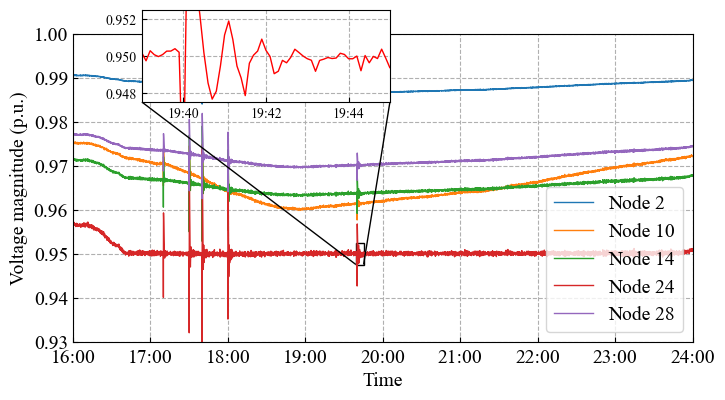
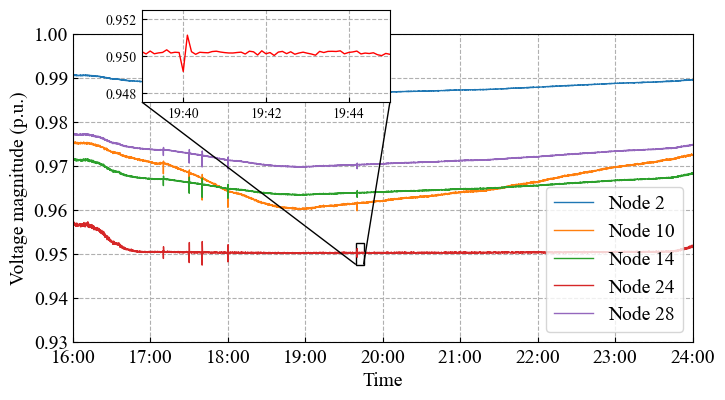
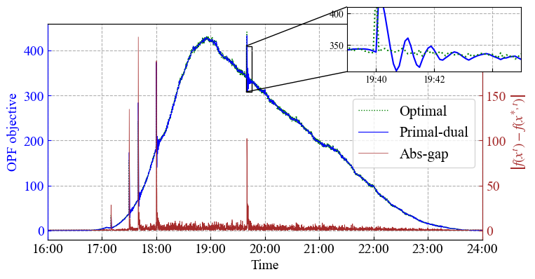
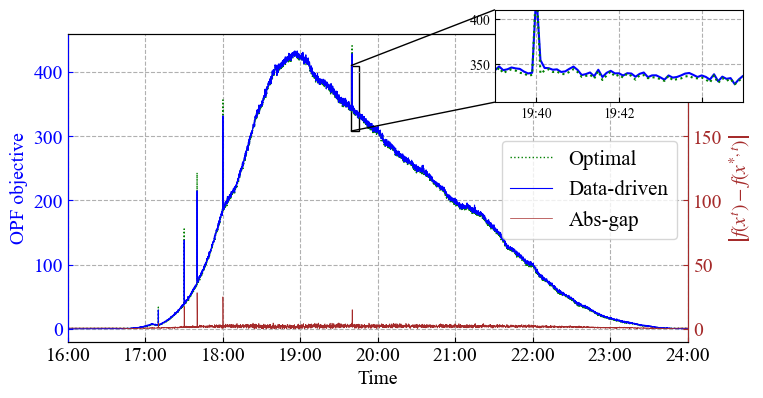

# A Data-Driven Real-Time Optimal Power Flow Algorithm Using Local Feedback in Distribution Networks

This repository contains source code necessary to reproduce the results presented in the following paper:

[A Data-Driven Real-Time Optimal Power Flow Algorithm Using Local Feedback in Distribution Networks]([https://arxiv.org/abs/2502.15306](https://ieeexplore.ieee.org/abstract/document/11194906))

Authors: Heng Liang, Yujin Huang, Changhong Zhao


# How to train
>python main.py --env_name case37 --train_flag True --trial_name alpha01 <br />

# How to test
>python test.py --env_name case37 --train_flag False --trial_name alpha01 --lineargrad True <br />
#A pretrained model is provided in "model_pth" (use the default trial_name).

# Results on real-world data
## The voltage profiles


(a) The voltage profiles achieved by primal-dual control.



(b) The voltage profiles achieved by the data-driven control.

## The OPF objectives and tracking errors


(a) The OPF objective values achieved by primal-dual control.



(b) The OPF objective values achieved by the data-driven control.

# Citation
If you find our code helpful, please cite our paper.

````
@article{liang2025data,
  title={A Data-Driven Real-Time Optimal Power Flow Algorithm Using Local Feedback},
  author={Liang, Heng and Huang, Yujin and Zhao, Changhong},
  journal={arXiv preprint arXiv:2502.15306},
  year={2025}
}
````
